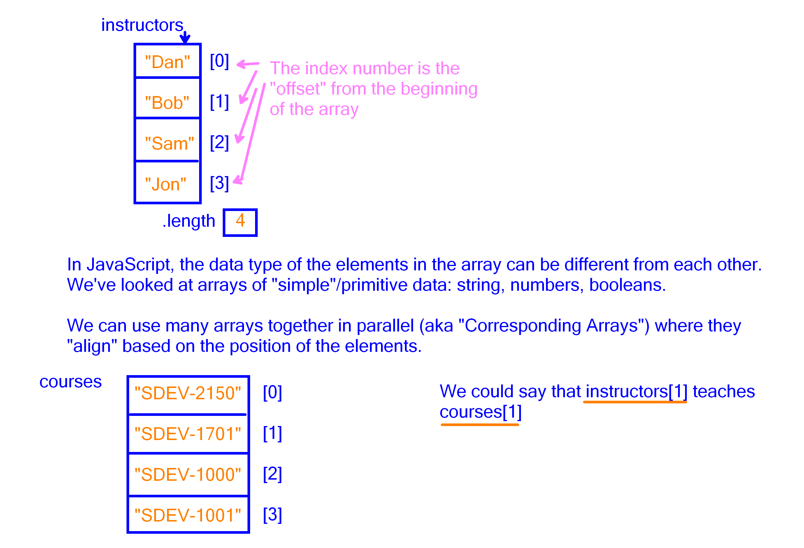

# Intro to Arrays in JavaScript

We've been using the [`demo.js`](./demo.js) to go over examples of parallel arrays and arrays of objects. The concept of arrays appears in pretty much every programming language.

;

By the way, the markdown way to show an image is in the following format:

```md

```

Markdown content can be easily converted to HTML. The above markdown is equivalent to the following in HTML.

```html

```

